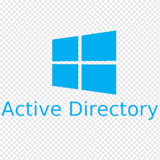

# CERT.PL's warning list tools

A scripts, utilities, and documentation intended to help with integrating CERT.PL's Dangerous websites Warning List.

Because of the intended audience, the rest of this repository is in Polish.

  

## Lista Ostrzeżeń przed niebezpiecznymi stronami CERT Polska

Lista Ostrzeżeń jest nieprzerwanie prowadzona przez CERT Polska od 2020 roku i zawiera **domeny, które wprowadzają użytkowników w błąd** i wyłudzają od nich dane. Celem Listy jest chronienie użytkowników końcowych przed wejściem na niebezpieczną domenę poprzez zablokowanie jej na poziomie DNS. Dzięki porozumieniom zawiązanym z operatorami telekomunikacyjnymi, wielu użytkowników nieświadomie korzysta z Listy za ich pośrednictwem. W celu weryfikacji, czy urządzenie z którego korzystamy jest obecnie chronione przez Listę, można skorzystać z serwisu [lista.cert.pl](https://lista.cert.pl).

Więcej informacji o Liście Ostrzeżeń można znaleźć pod adresem [https://cert.pl/lista-ostrzezen/](https://cert.pl/lista-ostrzezen/).

**Ta instrukcja kierowana jest do osób technicznych**, które chcą w swojej organizacji albo na swoich urządzeniach wdrożyć Listę Ostrzeżeń CERT Polska, bez opierania się na implementacji operatora.

Niezależnie od wybranej metody, **krytycznie ważne** jest, aby automatycznie i nieustannie ją **aktualizować** - sugerujemy aktualizację **co 5 minut**. Z naszego doświadczenia, oraz wielu badań wykonanych w tym temacie wynika, że większość domen phishingowych jest wykorzystywana w atakach w ciągu kilku godzin od rejestracji. Dlatego aktualizacja raz dziennie lub rzadziej nie chroni skutecznie użytkowników.

**Integracja Listy na komputerze z systemem Windows**

  

CERT Polska dostarcza skrypty pozwalające na automatyczne pobieranie i aktualizację Listy na komputerach z systemem Windows.

Dokładne instrukcje znajdują się w folderze [WindowsEndpoint](./WindowsEndpoint/).

**Integracja Listy na poziomie Domeny Active Directory**

  

CERT Polska dostarcza skrypty pozwalające na automatyczne pobieranie i aktualizację Listy w organizacjach korzystających z Active Directory.

Dokładne instrukcje znajdują się w folderze [WindowsDomain](./WindowsDomain/).

**Integracja Listy z przeglądarką internetową**

  
  

Rekomendowana jest integracja Listy na poziomie systemu operacyjnego. Jeśli to niemożliwe albo niewskazane, CERT Polska dostarcza również Listę w formacie AdBlock, którą można zaimportować do rozszerzenia przeglądarki. Szczegółowe informacje na ten temat można znaleźć na stronie https://cert-polska.github.io/adblock-domain-list/.

**Integracja Listy na telefonie**

  

W wielu przypadkach telefon jest już chroniony przez dostawcę sieci. W celu pełniejszej ochrony, można skorzystać z instrukcji [konfiguracji bezpiecznego serwera DNS](./DNS/).

**Integracja Listy z wybranymi zewnętrznymi rozwiązaniami**

  

CERT Polska nie wspiera oficjalnie zewnętrznych dostawców urządzeń i usług sieciowych.

Dostarczamy jednak instrukcje [integracji Listy z pozostałymi rozwiązaniami](./ThirdParty/),
oraz w niektórych przypadkach linki do zewnętrznych artykułów.

**Konfiguracja bezpiecznego serwera DNS**

Ostatnią opcją na prostą integrację Listy jest skorzystanie z bezpiecznego serwera DNS, który odrzuca zapytania o domeny znajdujące się na Liście Ostrzeżeń. Można w tym celu zapoznać się z instrukcją [konfiguracji bezpiecznego serwera DNS](./DNS/)
