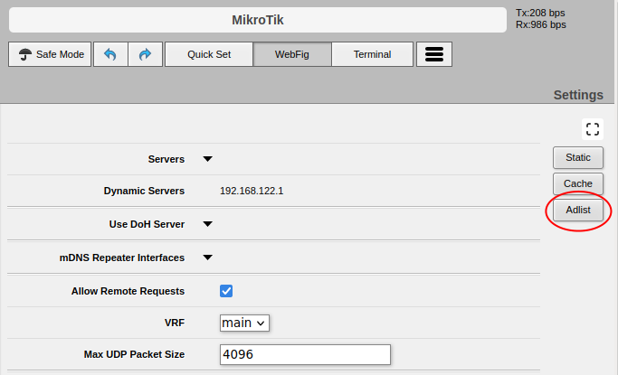
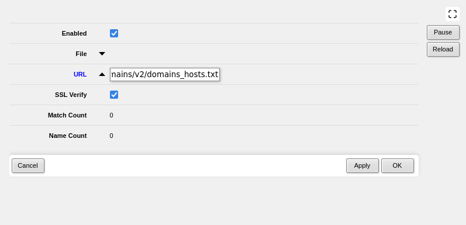

# Integracja Listy z systemem RouterOS / Mikrotik

W systemie RouterOS **od wersji 7.15** dostępna jest funkcja "adlist",
którą można wykorzystać w celu integracji Listy CERT Polska.
Z uwagi na ograniczenia techniczne urządzeń Mikrotik, **nie jest możliwe**
poprawne wdrożenie Listy na starszych wersjach tego systemu operacyjnego.

Najprostszy sposób integracji Listy to wejście w widok `Terminal` (w prawym górnym rogu)
i wykonanie **po kolei** (wklejając po jednej linii) poniższych poleceń:

```txt
tool/fetch url="https://raw.githubusercontent.com/CERT-Polska/warning-list-tools/master/ThirdParty/cert-pl-chain.pem"
certificate/import file-name="cert-pl-chain.pem"
ip/dns/set cache-size=50000KiB
system/script/add name="certlist-reload" source="ip/dns/adlist reload"
system/scheduler add name=certlist-5m interval=5m on-event="certlist-reload"
ip/dns/adlist add url="https://hole.cert.pl/domains/v2/domains_hosts.txt"
```

### Ręczna instalacja Listy

W tym celu należy zalogować się do panelu administratora i
przejść w menu do widoku `IP -> DNS`. Na poniższym zrzucie ekranu
zaznaczono na czerwono przycisk `Adlist`. Jeśli brakuje go,
oznacza to, że do wdrożenia Listy potrzebna jest aktualizacja systemu.



Po wejściu w ten widok należy kliknąć "Add New" i w pole URL wpisać
`https://hole.cert.pl/domains/v2/domains_hosts.txt`.



A następnie zapisać wynik. **To nie koniec**, należy czytać dalej.

Ten krok można wykonać też poleceniem:

```
ip/dns/adlist add url="https://hole.cert.pl/domains/v2/domains_hosts.txt"
```

### Import certyfikatu CA

Kolejny krok to import certyfikatów. Należy pobrać Certyfikat CA dla strony
hole.cert.pl (można go pobrać [STĄD](./cert-pl-chain.pem), albo samodzielnie za pomocą przeglądarki).
Następnie wejść w widok `files`, zuploadować pobrany plik, wejść w widok `System -> Certificates -> Import`,
wybrać załadowany właśnie certyfikat i zaimportować go.

Można zrobić to też poleceniem:

```
tool/fetch url="https://raw.githubusercontent.com/CERT-Polska/warning-list-tools/master/ThirdParty/cert-pl-chain.pem"
certificate/import file-name="cert-pl-chain.pem" 
```

**To dalej nie koniec** - Lista zaimportuje się, ale tylko częściowo. 

### Cache DNS

W celu integracji Listy prawdopodobnie należy zwiększyć ilość pamięci
poświęconej na Cache DNS. Aktualnie Lista potrzebuje około 30MiB pamięci podręcznej DNS,
ale polecamy zaalokować więcej - w razie, gdyby Lista powiększyła się.

Można to zrobić z widoku `IP -> DNS`, albo poleceniem:

```
ip/dns/set cache-size=50000KiB
```

**To dalej nie koniec** - domyślny okres aktualizacji Listy jest zbyt długi.

### Automatyzacja

Domyślnie Lista aktualizowana jest na urządzeniu co godzinę. Naszym zdaniem jest to zdecydowanie za długi czas.

Z tego powodu, rekomendowane jest aktualizowanie Listy co 5 minut za pomocą polecenia:

```
/ip/dns/adlist reload
```

W celu automatyzacji tego procesu, należy stworzyć skrypt o powyższej treści, a następnie
zadanie Schedulera, które będzie go wykonywało co 5 minut (ustawiając on-event na nazwę skryptu).

Można to zrobić ręcznie z panelu administracyjnego, albo za pomocą polecenia:

```
system/script/add name="certlist-reload" source="ip/dns/adlist reload"
system/scheduler add name=certlist-5m interval=5m on-event="certlist-reload"
```

### Oficjalna dokumentacja

W razie problemów, można skonsultować się z oficjalną dokumentacją producenta:

https://help.mikrotik.com/docs/display/ROS/DNS#DNS-Adlist
